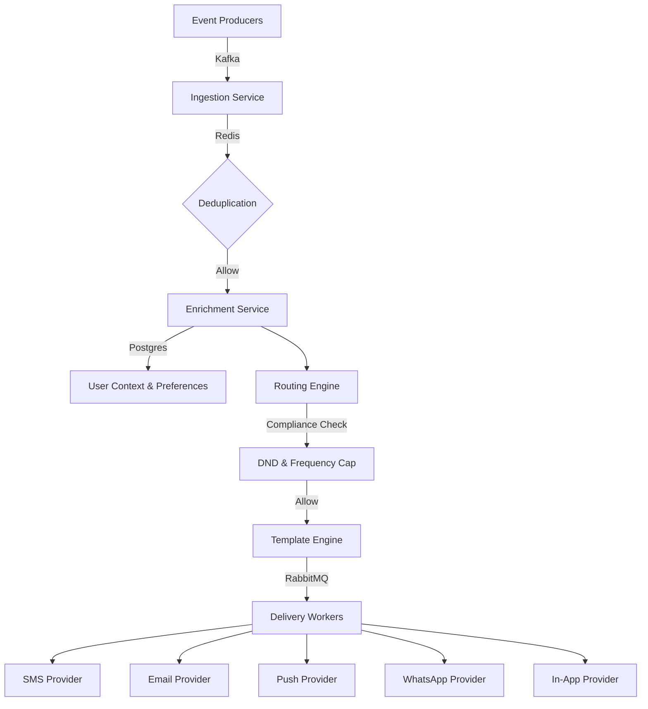

# Architecture Design

## System Context
The Notification Engine ingests events from various financial systems (Trading Engine, Margin Engine, etc.) and delivers them to users via multiple channels.

## Component Diagram

## Technology Decisions

### Event Streaming (Kafka)
We use Kafka as the primary event bus for ingestion. Its log-based architecture allows for:
- **High Throughput**: Capable of handling millions of events daily.
- **Persistence & Replay**: Critical for regulatory audits and disaster recovery.
- **Consumer Groups**: Enabling parallel processing by scaling workers.

### Delivery Routing (RabbitMQ)
While Kafka is great for streaming, RabbitMQ provides sophisticated routing capabilities:
- **Priority Queues**: Ensuring CRITICAL notifications (margin calls) bypass LOW priority ones (market updates).
- **Complex Routing**: Easy fan-out and multi-channel delivery logic.
- **Dead Letter Exchanges**: Robust handling of delivery failures.

### Real-time State (Redis)
Redis handles low-latency operations:
- **Frequency Capping**: Atomic increments for per-user limits.
- **Idempotency**: Preventing duplicate notifications within a sliding window.
- **Caching**: Storing user preferences and DND status for fast resolution.

### Persistent Storage (PostgreSQL)
Postgres serves as the source of truth for:
- **Notification Logs**: Partitioned by time (monthly) for performance.
- **User Preferences**: Structured storage of granular settings.
- **Templates**: Versioned storage of message templates.
